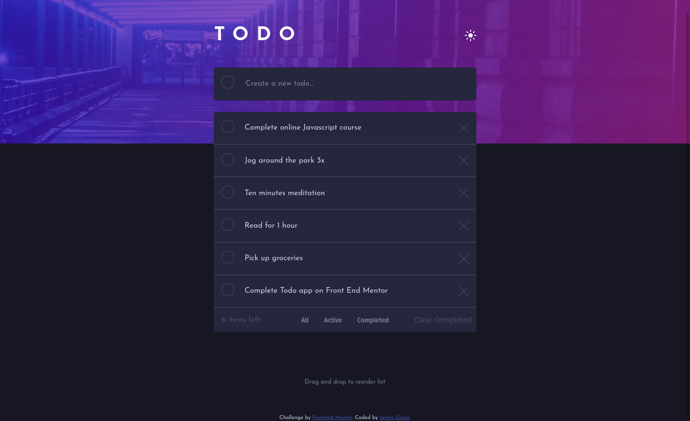
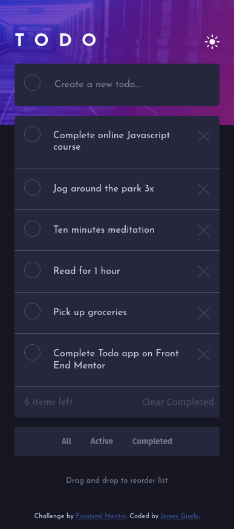

# Frontend Mentor - Todo app solution

This is a solution to the [Todo app challenge on Frontend Mentor](https://www.frontendmentor.io/challenges/todo-app-Su1_KokOW). Frontend Mentor challenges help you improve your coding skills by building realistic projects. 

## Table of contents

- [Overview](#overview)
  - [The challenge](#the-challenge)
  - [Screenshot](#screenshot)
  - [Links](#links)
- [My process](#my-process)
  - [Built with](#built-with)
  - [What I learned](#what-i-learned)
  - [Useful resources](#useful-resources)
- [Author](#author)

## Overview

### The challenge

Users should be able to:

- View the optimal layout for the app depending on their device's screen size
- See hover states for all interactive elements on the page
- Add new todos to the list
- Mark todos as complete
- Delete todos from the list
- Filter by all/active/complete todos
- Clear all completed todos
- Toggle light and dark mode
- **Bonus**: Drag and drop to reorder items on the list
- **Extra Bonus**: Persistent storage

### Screenshot

### Links

- [Solution URL](https://github.com/jmgisele/todo-app-main)
- [Live Site URL](https://jmgisele.github.io/todo-app-main/)

## My process

### Built with

- Flexbox
- Mobile-first workflow
- Sortable.js
- Semantic and Accessible HTML
- IndexedDB (IDB)
- [IndexedDB promised library](https://github.com/jakearchibald/idb)

### What I learned
I decided to come back to this app after a few months and re-make it with persistent storage! I did my best to make the form accessible via keyboard as well, as I was less experienced when I coded this originally and wasn't aware of best practices. Storage is handled client-side using IndexedDB. This is my first project using client-side storage other than basic cookies/session, so it was a good easy way to test stuff out. 

I ended up using the promised-IDB library by Jake Archibald ([link](https://github.com/jakearchibald/idb)) which made things a lot easier for my async/await-trained skills. I figured client-side storage would be simpler than setting up a whole backend. . . but honestly, I'm not that sure. MongoDB/Express and Heroku make things pretty easy to set up, whereas IndexDB is a bit of a pain. The [MDN Guide](https://developer.mozilla.org/en-US/docs/Web/API/IndexedDB_API) was helpful as always, but the syntax feels out of date and unfamiliar. If I were remaking this project, I'd probably just whip up a quick Node/Express/Mongo backend with session that refreshed after a week or so and cleared entries out. That way users wouldn't have to log in but could have semi-persistent storage using session. But this was my first project with client-side storage, it was good for learning a new skill, and I'm just that much more appreciative of async/await functionality now. 

Some bugs I'm aware of but didn't feel like ironing out:
- Order of the todos doesn't persist on re-load. This could be implemented using a property on the IDB entry for each todo that kept track of its place in the page, maybe using on drop handlers thru sortable.
- The way I handle keys for IDB vs ids for the DOM is...creative. I'm sure IDB has a better way of keeping track of things using auto-increment but after messing around with IDB for a day I decided I'd rather simply design an id that would assign keys uniquely and be done with it. If this were a production app whose code would be handed down for years I'd find a way to implement it more transparently!

### Useful resources

- [abhik-b's solution](https://github.com/abhik-b/frontend-challenge-3) - was very helpful in figuring out Sortable.js, which I'd never used before!
- [Here is SortableJS](https://sortablejs.github.io/Sortable/), which is what I used to create the drag-and-drop functionality.
- [The MDN Client-side storage guide](https://developer.mozilla.org/en-US/docs/Learn/JavaScript/Client-side_web_APIs/Client-side_storage) conveniently used an example of a todo app.
- [Jake Archibald's IDB promised library](https://github.com/jakearchibald/idb) saved me a lot of IDB woes and makes interacting with the db more intuitive

## Author

- Github - [@jmgisele](https://github.com/jmgisele)
- Frontend Mentor - [@jmgisele](https://www.frontendmentor.io/profile/jmgisele)